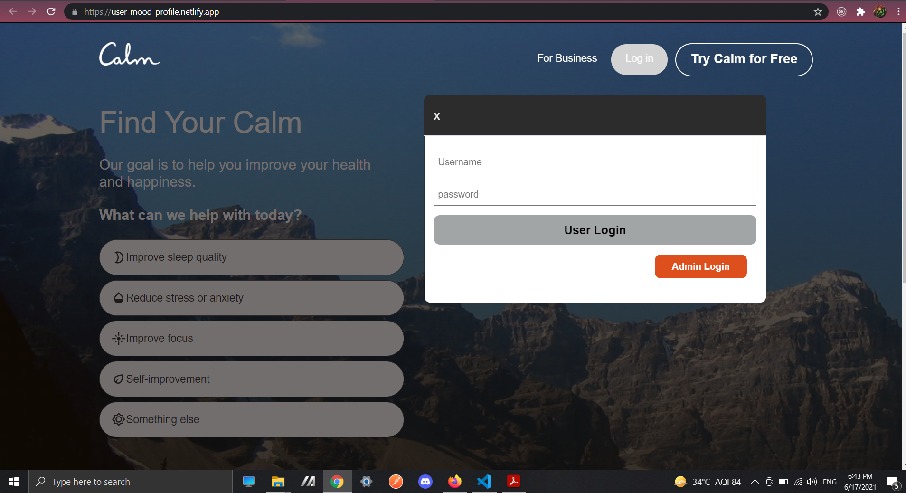
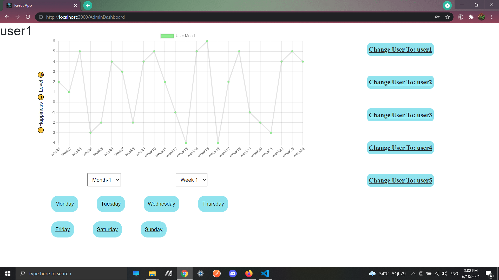

## Firstly Clone of (calm.com) Landing page is made.

## Then on using Login button, first we get fields for users to access their dashboards with user login button.

## On the same display we get the admin login button by which on pressing a new login modal will open for the Admin to access his dashboard.

## for user- Username and password is requirewd to enter their dashboard but for Admin, He'll be required A key to login.

## User
**UserNames - user1 to user5 , Password - 12345

## Admin 
**AdminKey -  ADMIN

-------------------------------------------------------------------------------------------------------------------------------------------------------------------
## The data which is shown through the graph shows the Mood of user at a given time--
### If the user is Happpy then the scale will go above 0 towards=> Positive Direction(+).
### If user is Neutral then the scale will stop at 0. 
### If user is Unhappy then the scale will go below 0 towards=> Negative Direction(-).
--------------------------------------------------------------------------------------------------------------------------------------------------------------------

## On the respective Dashboards of Users and of Admin we get to see the data of user Moods throught a time.

## On user Dashboard a single user can see his data at a time throught his months,weeks and days.

## On Admin Dashboard, Admin can view any User's data of any time he want throught six months.

## on each Dashboard a menu is given to select Months and Weeks and below that each day is provided so that they can view the data they want of any day in 6 months.
